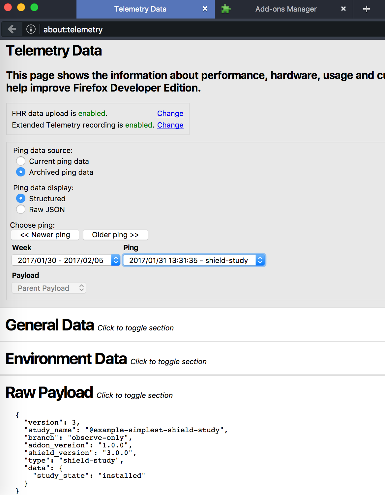

# Example Shield Study Addon.

## features

- 2 files, no real feature
- one variation, all defaults for everything

## install:

```npm install```
```npm install -g shield-study-cli```

##run:

```
shield run .
```

at random

```
shield run  . --debug  -- -b Aurora
```

## Explore:

1.  See output at the `console.log` from `shield`
2.  Uninstall at `about:addons` and see telemetry in console.
3.  look at `about:telemetry` > `archived ping data`


